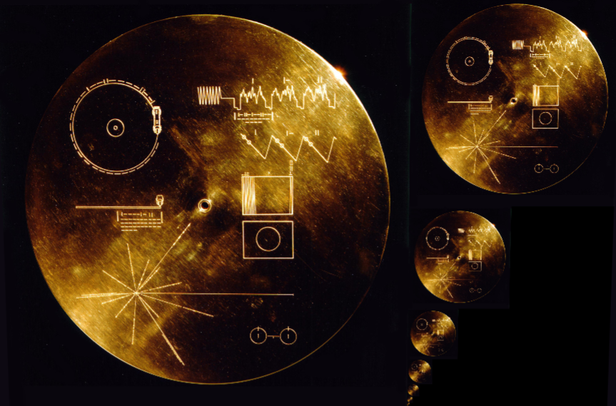

# Custom Mip Map Generation



Utility for generating a custom mipmap when blending the parent mip level and packing it into a texture.

NOTE: There is nothing to prevent bleeding on mip edges and works best with point sampling.

[Demo Here](https://gkjohnson.github.io/threejs-sandbox/custom-mipmap-generation/)

**TODO**
- Understand how a non power of two texture mipmap should be generated ([reference](https://www.nvidia.com/en-us/drivers/np2-mipmapping/))

# Use

```js
import { PackedMipmapGenerator } from './src/PackedMipmapGenerator.js';

// ...

const mipmapper = new PackedMipmapGenerator(
	`
	gl_FragColor = (
		samples[0][0] + samples[0][1] + samples[1][0] + samples[1][1]
	) / 4.0;
	`
);

mipmapper.update( texture, target, renderer );
mipmapper.dispose();
```

# API

## PackedMipmapGenerator

### constructor

```js
constructor( logic : string )
```

Takes a block of code to generate the next mip level. Must set the `gl_FragColor`. An matrix of the parent sibling values is available in the `samples` variable.

### .update
```js
update( texture : Texture, target : WebGLRenderTarget, renderer : WebGLRenderer ) : Number
```

Takes a texture to turn into a mip pyramid, a target to to render the pyramid into, and a rendeer to render with. Returns the number of mips generated.

### .dispose
```js
dispose() : void
```

Disposes of any created context objects.

## Sample Functions

### packedTexture2DLOD

```glsl
vec4 packedTexture2DLOD( sampler2D texture, vec2 uv, int level )
vec4 packedTexture2DLOD( sampler2D texture, vec2 uv, float level )
```

Shader functions for sampling the generated texture at a specific mip level. If the int variant is used only a single texture sample is made.
