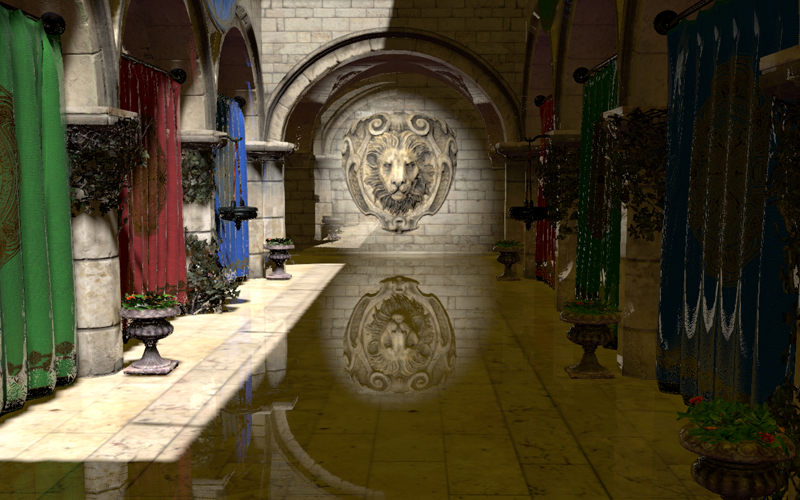

# Screen-Space Reflections Render Pass

A rough screen space reflections implementation based on [Morgan McGuire's screen space ray tracing article](http://casual-effects.blogspot.com/2014/08/screen-space-ray-tracing.html) and [Kode80's Unity SSRR implementation](https://github.com/kode80/kode80SSR).

_sponza scene from GLTF 2.0 example models_

[Demo here!](https://gkjohnson.github.io/threejs-sandbox/screenSpaceReflectionsPass/)

## Options
#### stride
The number of screen space pixels to step over per iteration in the down sampled depth texture.

#### steps
The number of steps to take along the cast ray.

#### binarySearchSteps
The number of extra iterations to take to search for the intersected surface.

#### intensity
The intensity of the reflection.

#### renderTargetScale
The per

## TODO / Issues
- Reflections can make a surface appear _darker_, which is incorrect
- Add blur based on roughness
- Support animations, normal, and roughness maps
- Add z fade
- Fade as we near the end of the ray
- Add controls
- The pass seems to make things really slow for some reason? GPU work isn't taking place until late in the frame?
- Use a better sampling function than the current jitter
- Improve the connected-ness of the reflections to the ground
- Perform raytracing on a downscaled buffer instead of just rendering depth and normals to downscaled buffers
- Objects in the close foreground can create incorrect reflections on the floor / further objects (looks like an interpolated sampling issue?)
- Objects with zero thickness create incorrect stretched reflections
- Blur with mipmaps and step through depth pyramid a la http://www.cse.chalmers.se/edu/year/2017/course/TDA361/Advanced%20Computer%20Graphics/Screen-space%20reflections.pdf
